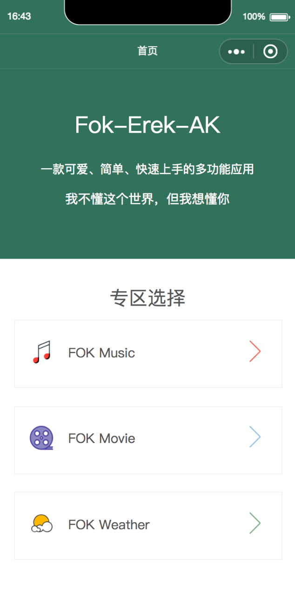
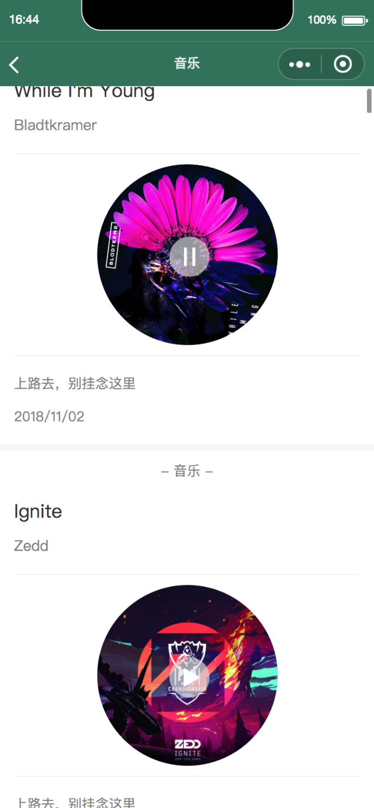
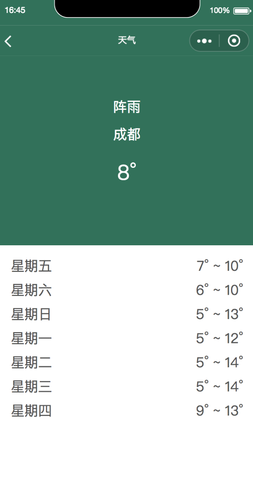

## Fok-Erek-AK

### v1.0.0 版本说明

#### 技术栈
- react
- redux
- taro
- prop-types
- classnames
- sass
- ...

#### 目标功能
- [x] 天气查询
- [x] 音乐播放、封面旋转
- [x] 视频播放
- [ ] ...

#### 部分界面

### 相关链接

博客 : https://github.com/PDKSophia/blog.io
 
掘金 : https://juejin.im/user/594ca8a35188250d892f4139
 
Erek-Resume : https://github.com/PDKSophia/erek-resume

Erek-Editor: https://github.com/PDKSophia/erek-editror
 
Vue-erek-manage: https://github.com/PDKSophia/vue-erek-manage

-----
 
版权所有Copyright © 2018 by PDK 
 
All rights reserved。
